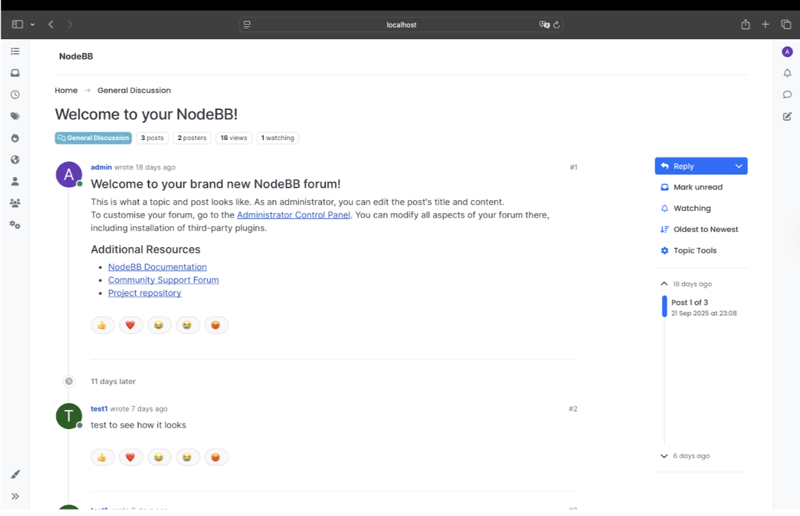
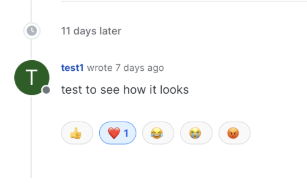
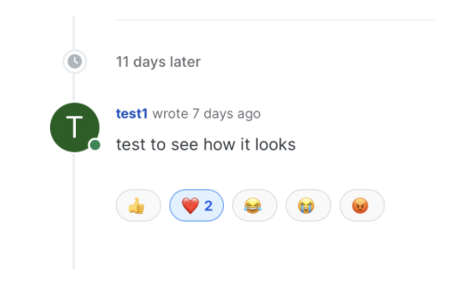
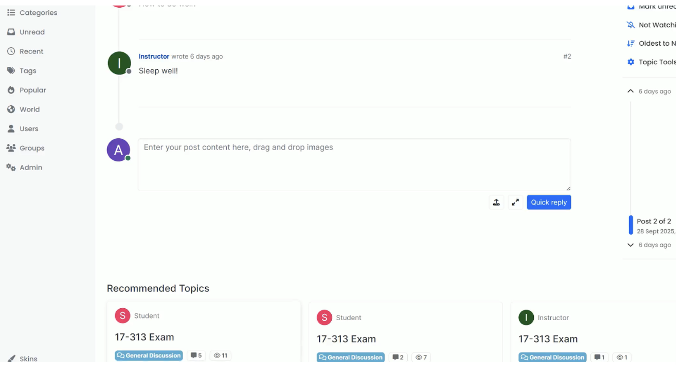

### **Project Overview**

- **Project Name:** Gituardo

- **Team Name / Members:** Anel Adalbek, Haneen Al-khuzaei, Shaikha Al-Emadi, Gustavo Ramalho, Mohammad Khan

- **Repository URL:** https://github.com/CMU-17313Q/nodebb-f25-gituardo

- **Purpose:** Briefly describe how to use and user test the new features we implemented

- **Summary of New Features:**

  - Feature 1: Add endorse post feature
  - Feature 2: Add reactions to discussion posts
  - Feature 3: Add a recommended posts section with a custom heuristic

### **Prerequisites and Setup**

- **System Requirements:**

  - Node.js / Python version
  - Database (MongoDB, Redis, etc.)
  - OS or browser requirements

- **Installation Steps:**

> git clone <https://github.com/CMU-17313Q/nodebb-f25-gituardo.git>
> 
> cd <nodebb-f25-gituardo>
> 
> ./nodebb setup
> 
> npm install

- **Run the Application:**
> ./nodebb start

### **Automated Testing**

**Purpose:** This section documents the automated test cases written for the new features.

**How to Run Tests:**
> npm run test

- **Expected Output:** All tests should pass, confirming correct implementation of the new features.

- **GitHub Actions Status:** *All GitHub Actions workflows should pass on the main branch.*

### **Feature Guides**

#### **Feature 1 --- Allow post owners to endorse a post as the "official" response to a topic**

**Branch:** feat-answered-tag (now merged into main)

**Description:** Administrators, moderators, specific groups (as assigned in the admin panel), and a topic owner can now endorse/unendorse a post as the official response for that topic.

**How to Use:**

1.  **Step-by-step instructions for trying out the feature:**

    - Create a topic

    - Wait until people respond to it

    - Any user with appropriate permissions can mark one or more of these responses as the endorsed answer

    - Such responses will be exhibited at the top of the topic, no matter their previous order

    - Users cannot endorse their own posts

2.  **Demo**

    [Endorse](https://drive.google.com/file/d/1bTeIh75K1q6IZhNnUfvv6I6d1byCzGRy/view?resourcekey)

**How to Test:**

- Manually: follow the steps above and certify yourself that the constraints given are true by creating and posting with different accounts.

- To run the automated tests: npm run test

**Automated Tests for This Feature:**

- Test File: /src/test/test_endorse.js

- What is being tested?

  - Creating a post → endorsing → unendorsing, checking the presence of the tag in each step.

  - Checking that is indeed not possible to endorse the main post of the topic, or with wrong privileges

- Why is it sufficient?

  - Because that covers all of the lines and use cases in the endorse features, including validation rules.

#### **Feature 2 --- Add reactions to discussion posts**

**Branch:** feature/post-reactions

**Description:** This feature allows students to add emoji-based reactions to discussion posts. This encourages engagement without cluttering discussions with short comments.

**How to Use:**

1.  **Step-by-step instructions for trying out the feature: Expected behavior or output**

- Open the app in a browser (./nodebb start) and log in as a student.

- Navigate to any discussion thread with posts.

- Verify a reaction bar appears under each post (emoji icons + counts).

- Click an emoji on a post and expect the emoji to get highlighted and the count for that emoji to increase immediately (+1)

- Click the same emoji again and expect the count to decrease immediately (-1) and the highlight to be removed

- Try to click the same emoji multiple times - the UI and back-end must prevent more than one reaction of the same type from the same user.

- After reloading the page, expect the counts and the user's reaction to remain the same as after the last changes

2.  **Screenshots**

**Reactions Interface:**

**User A reacted with a heart:**

**User B reacted with a heart:**

**API Endpoint:**

| **Method** | **Endpoint** | **Description** |
|------------|--------------|-----------------|
| POST | /api/reactions/toggle | Allows a user to add or remove a reaction on a specific post and updates the reaction count immediately. Returns the new reaction state. |

**How to Test:**

- Manually: follow the "How to use" instructions

- To run the automated tests: npm run test

**Automated Tests for This Feature:**

- Test File: /test/reactions.js

- What is being tested?

  - User can add a reaction
  - User can remove a reaction
  - Same user cannot add the same reaction multiple times
  - Correct user reaction type (it changes the color of the button)
  - Correct count
  - Missing data (400 error message displayed)
  - No post (404 error message displayed)

- Why is it sufficient?

  - These tests follow our acceptance criteria; they provide full functional coverage of the reactions feature, ensuring it follows the correct behavior and robust error handling. It tests all the potential steps a user might take to interact with the reactions feature.

#### **Feature 3 --- Recommended topics section**

**Branch:** feat-recommended-posts

**Description:** Adds a section with recommended topics for users, ranking them based on cosine similarity on Tensorflow's Universal Sentence Encoder's output

**How to Use:**

1.  **Step-by-step instructions for trying out the feature:**

- Open a post
- Scroll down
- You should be able to see recommended posts with tag, views, and comments data
- You can click and be directed to the post

2.  **Screenshots**

**Recommended posts section**

**How to Test:**

- Manually: following steps above, perhaps creating different related posts
- To run the automated tests: npm run test

**Automated Tests for This Feature:**

- Test File: /src/test/test_recommended.js

- What is being tested?

  - Tensorflow model loads correctly
  - Creating posts in different topics (programming, recipes, academics, etc)
  - Ranking them multiple times with different subsets of the posts, checking with a hardcoded rubric

- Why is it sufficient?

  - These tests comprehensively verify the recommendation logic, its robustness, and its correctness, making them sufficient for automated validation of the feature.

**Contributors**

| **Name** | **Role** | **Main Contributions** |
|----------|----------|------------------------|
| Gustavo Grancieiro | Developer | Feature 1: Back-end (part of), front-end, testing Feature 3: Front-end, testing |
| Mohammad Khan | Developer | Feature 1: Back-end (part of), front-end integration Feature 3: Back-end |
| Shaikha Al-Emadi | Developer | Feature 2: backend API endpoints implementation, automated testing, code review |
| Anel Adalbek | Developer | Feature 2, frontend implementation, integration with backend APIs, code documentation |
| Haneen Al-Khuzaei | Developer | Feature 2, backend controllers and validation implementation, automated testing, API documentation |
